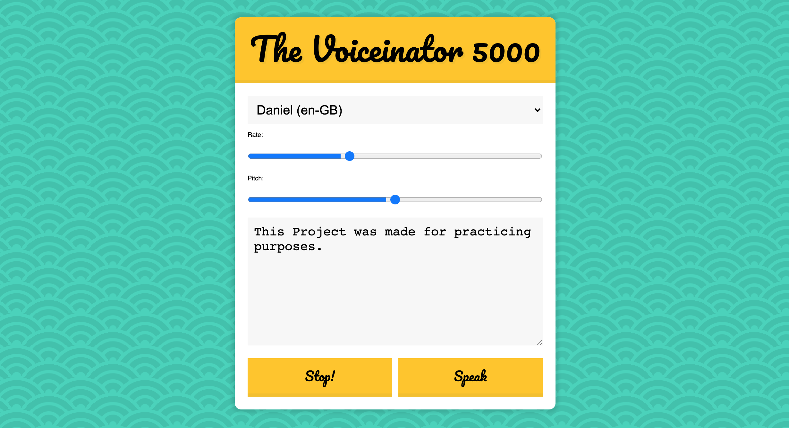

# Speech Synthesis

Day 23 of Javascript30 by WesBos. Made a site where it speaks out loud the text you have written. You can also change the speedrate and the voice pitch. You can also choose different accents and voices.

# Demo

# Technologies Used

HTML5, CSS, Vanilla JS

# Website

https://buigabor.github.io/speech-synthesis/
